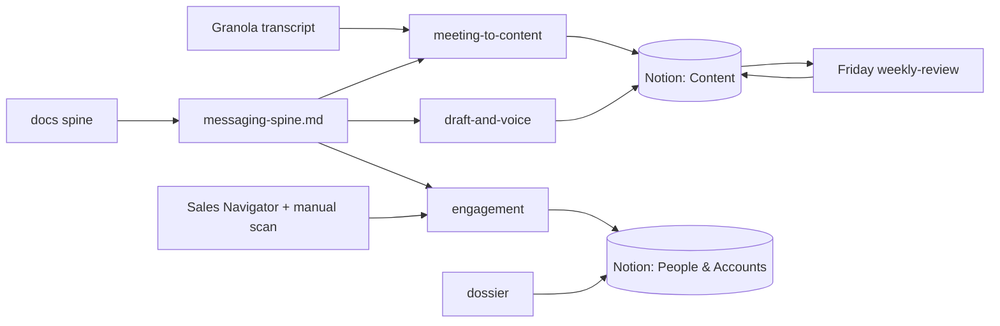

# Content Ops

A LinkedIn-first content operating system for Ryle (confidential digital asset infrastructure). It converts two proprietary inputs — Granola meeting transcripts and the product docs — into founder-voice LinkedIn posts and high-quality comments. Everything is human-approved before publishing.

The goal is not volume. The goal is that every week you have a handful of genuinely sharp posts and comments that start real conversations with stablecoin, RWA, bank, payments, infra, and VC people.

## How it fits together

- **Voice + arguments** live in [`messaging-spine.md`](messaging-spine.md). Every prompt references it. Update it first when positioning changes.
- **Prompts** live in [`prompts/`](prompts/). Paste the spine + a prompt + your input into Claude/ChatGPT.
- **The working surface** is Notion (two databases). See [`notion-ops.md`](notion-ops.md) for links and the daily/weekly cadence.
- **Granola** connects via MCP in Cursor (`granola` → `https://mcp.granola.ai/mcp`). See the Granola MCP section in [`notion-ops.md`](notion-ops.md) for OAuth and chained workflows.

## The prompts

- [`prompts/meeting-to-content.md`](prompts/meeting-to-content.md) — FLAGSHIP. Granola transcript → anonymized learnings + LinkedIn drafts + follow-ups. Anonymization is step one.
- [`prompts/draft-and-voice.md`](prompts/draft-and-voice.md) — an insight/angle → finished draft in voice.
- [`prompts/engagement.md`](prompts/engagement.md) — a target post → comment angles (you write the final comment).
- [`prompts/dossier.md`](prompts/dossier.md) — an account/person → pre-meeting brief.
- [`prompts/weekly-review.md`](prompts/weekly-review.md) — Friday review + next week's plan.

## Notion

- Ryle Content Ops: https://www.notion.so/37236e1bc77a81cca809e68062d436b6
- Content DB: https://www.notion.so/e91660d3121b41d2b5455a3da6ca2f17
- People & Accounts DB: https://www.notion.so/c7189c045da94c3e9fc4fea6436b5fcf

Both DBs are seeded with example rows you should replace.

## 30-day rollout

- **Week 1** — Read the spine; run `meeting-to-content` on 2-3 past Granola transcripts; file drafts in the Content DB.
- **Week 2** — Build Sales Navigator target lists; mirror a "must-engage" set into People & Accounts; start the daily engagement loop with `engagement.md`.
- **Week 3** — Run `dossier.md` before meetings; hold a steady ~3 posts/week.
- **Week 4** — Start the Friday `weekly-review` ritual; build an evergreen library from the posts that started real conversations.

## Principles

- Quality over volume. A competitor-generic post is worse than no post.
- Confidential by default applies to our own inputs too: anonymize transcripts, keep client identities internal.
- Nothing auto-publishes. Approval is always a human decision.
- The metric is relevant conversations started, not likes.

## Not in scope (yet)

Code/scripts, schedulers (Typefully/Buffer/n8n), any social API, automated monitoring, auto-publishing, and an automated analytics agent. Add these only once the manual system is consistently producing things worth posting.
