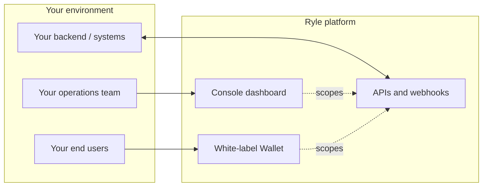

# Ryle — Platform Overview for Integration Partners

> Audience: technical business stakeholders, product teams, and engineering teams evaluating whether to integrate. This document is intentionally high level. It describes what Ryle enables, how integration works, and where the platform fits in your stack — without going into protocol or cryptographic implementation detail.

---

## 1. Executive summary

**Ryle is infrastructure for issuing, managing, and operating confidential digital assets.**

Companies that want to put assets on-chain — stablecoins, tokenized financial instruments, internal treasury balances, collateral — increasingly need two things at once: programmability and confidentiality. Today, getting both means assembling blockchain expertise, custody tooling, compliance workflows, and privacy technology in-house. Most teams should not be doing that.

Ryle provides a single platform that abstracts that complexity. Through a Console (for operators) and a set of APIs (for engineering), partners can launch a confidential asset, manage participants and policies, monitor activity, and integrate the result into their existing products and workflows — without becoming experts in confidential networks, zero-knowledge systems, or blockchain internals.

The result is faster time-to-market, lower operational burden, and a clear separation between *what you want your asset to do* (your business) and *how the underlying network makes it work* (Ryle's job).

---

## 2. The problem

Working with tokenized and confidential digital assets today is harder than it should be.

- **Operational complexity is high.** Issuing an asset is the easy part. Day-to-day operations — minting and redeeming against reserves, managing who can hold or transact, reconciling balances, responding to incidents, generating audit trails — require dedicated tooling that most teams have to build themselves.
- **Confidentiality requirements block adoption.** Many real-world use cases (B2B payments, treasury operations, regulated assets, institutional flows) cannot tolerate every balance and transfer being publicly visible. Public-by-default networks make these use cases non-starters.
- **Becoming a blockchain shop is expensive.** Hiring teams that understand confidential networks, zero-knowledge systems, custody, and compliance is slow and costly. Most product teams want the *outcome* — confidential, programmable assets — without owning the underlying stack.
- **Existing tooling is fragmented.** Block explorers, custody dashboards, compliance tooling, and developer SDKs each solve a slice of the problem. Stitching them together leaves gaps in usability, control, auditability, and integration simplicity.

Partners adopting Ryle are looking for the same things: a clean operator experience, a predictable API surface, controllable confidentiality, and an integration model that fits inside an existing product or fintech stack.

---

## 3. Platform overview

Ryle is a backend layer for confidential digital assets, exposed through three surfaces. Two are mandatory for any integration; the third is optional.

| Surface | Audience | Purpose |
|---|---|---|
| **Console** | Operators, business and compliance teams | A unified web dashboard to manage assets, participants, policies, and operations. |
| **APIs** | Developers, internal systems | A programmatic interface to integrate Ryle into existing products, back-office systems, and automation. |
| **White-label Wallet** *(optional)* | Your end users | A customer-facing wallet you can ship under your own brand, configured from the Console. |

A single Ryle organization can run multiple assets in parallel, each with its own policies, accounts, and operational model. Whether the asset is a brand-new confidential instrument, a confidential layer on top of an asset you already issue, or confidentiality offered as a service on a third-party asset, the same Console, the same APIs, and the same integration model apply.

The platform is multi-tenant by design. Your assets, your participants, your team, and your audit trail are scoped to your organization.

---

## 4. Core capabilities

### Asset creation and lifecycle management
Launch a confidential asset from a guided flow — choose the integration shape that matches your use case (a new confidential asset, a confidential layer on an asset you already issue, or confidentiality offered on a third-party asset), set parameters (name, symbol, supply rules, fees), and go live. Assets can be paused, reconfigured within policy, and wound down through the same surface.

### Visibility and control through a dashboard
A single operator dashboard for everything an operations team needs day-to-day: supply and reserve health, mint and redeem activity, participant management, alerts, and audit history. Designed for non-blockchain-native operators.

### API-based integration into existing products and workflows
Every operation available in the Console is also available through the API. Mint, redeem, manage participants, configure policies, and consume real-time events via webhooks — from your own backend, with no need to interact with the underlying network directly.

### Permissions and controlled information access
Operator roles (Owner, Admin, Operator, Compliance, Auditor, Viewer) scope what each team member can see and do. End users only see their own data. Compliance and audit roles can read without acting. The platform enforces these boundaries consistently across both Console and API.

### Operational monitoring and status tracking
Real-time visibility into supply, reserves, reconciliation, redemption queues, webhook delivery, and API usage. Alerts surface issues — divergence, queue backups, delivery failures — before they become problems.

### Administrative controls and policy configuration
Configure who can hold the asset, who can act on it, and under what limits. Update fee schedules, transaction limits, KYC requirements, and pause/resume operations from a single place. Every privileged change is logged.

### Support for selective disclosure and controlled sharing
When a regulator, auditor, or counterparty needs visibility into specific data, the platform supports scoped, time-bounded, fully audited disclosures — without making that data ambient. The default state is private; visibility is the result of a deliberate policy decision.

### Abstraction of network and infrastructure complexity
You do not write custody code or manage nodes, key infrastructure, or confidential-network logic. Ryle is not a custodian: you connect a custody solution you already operate (institutional custodian, MPC vendor, or equivalent), and Ryle binds the asset to it. A self-hosted custody product that runs inside your own infrastructure is on the roadmap. Settlement is on EVM-compatible chains (e.g. Ethereum, Polygon, Base, Arc, Plasma, Tempo); the chain target is a configuration choice per deployment, not a code change in your integration. You work with assets, accounts, and operations.

---

## 5. Dashboard experience

The Console is where operators run the asset program day-to-day. It is designed to feel like a modern fintech dashboard — clear, fast, and unambiguous — not like a block explorer or a developer tool.

A typical operator can:

- **Manage assets.** See every asset the organization runs, drill into one to view supply, reserves, reconciliation status, recent activity, and alerts.
- **Run mint and redeem operations.** Reconcile public-side reserves against confidential supply, review and approve redemption requests, configure limits and fees, pause or resume flows.
- **Manage accounts.** Maintain the list of accounts permitted to hold or transact with the asset, link KYC records, assign tags, and bulk-import.
- **Assign roles and permissions.** Grant operator roles to teammates, manage compliance reviewers, set up SSO and MFA.
- **Investigate activity.** A chronological feed of every operator action and every public asset event, with a per-event detail pane for raw data when needed.
- **Configure the white-label wallet.** Branding, onboarding methods, feature toggles, and product-level analytics for the customer-facing wallet.
- **Generate reports and audit exports.** Export filtered activity, reconciliation snapshots, and compliance records on demand.

The privacy boundary is enforced consistently in the UI: the operator sees their own actions and aggregate health, never end-user balances or transaction graphs.

Underneath the white-label wallet, each end user is provisioned a per-user embedded EVM wallet automatically on first login (via Privy among other embedded-wallet providers): no seed phrases, no recovery flows, and no key material for partner teams or end users to manage. Wallet keys are held by the embedded-wallet provider, not by Ryle.

---

## 6. API experience

The API is built around a small set of stable, predictable primitives so engineering teams can integrate Ryle the same way they would integrate a payments processor or a card issuer.

**Design philosophy:**

- **Few, well-named primitives.** Assets, accounts (a policy record per identity, not a balance), mints, redemptions, policies, events. Most workflows are a small composition of these.
- **No confidential-network plumbing in your code.** You call business-level operations. The platform coordinates signing through your connected custody and embedded-wallet providers, handles network coordination, and enforces confidentiality — without Ryle holding asset or wallet keys.
- **Predictable request/response shapes.** Idempotent operations, stable identifiers, machine-readable error codes.
- **Webhooks for everything.** Subscribe to lifecycle events (asset state changes, mint and redeem progression, policy updates, alerts) and consume them with replay, retries, and per-delivery logs.
- **Sandbox and live parity.** Build and test against a sandbox environment whose schema is identical to production, then promote with confidence.
- **First-class developer tooling.** API key management with scopes, IP restrictions, fingerprinting; per-call logs; an in-Console "Try it" runner; auto-generated event schemas.

The result: your engineers integrate using familiar patterns, with no exposure to the confidential-network internals or cryptographic operations underneath.

---

## 7. Integration model

A typical partner adoption looks like this:

1. **Onboarding.** Create your organization, set up your team, and complete basic verification.
2. **Asset configuration.** Choose the integration shape that matches your use case (a brand-new confidential asset, a confidential layer on an asset you already issue, or confidentiality offered on a third-party asset). Set parameters, policies, and accounts.
3. **Wire up your systems.** Issue API keys, configure webhooks pointing at your backend, and integrate the operations you need: mint, redeem, account management, monitoring.
4. **(Optional) Configure the white-label wallet.** Brand it, set up onboarding, and decide which features your end users get.
5. **Test in sandbox.** Run end-to-end flows against the sandbox environment with full visibility.
6. **Go live.** Promote configuration to production through a guided checklist (team setup, signers, reserves, webhook endpoints).

The platform fits naturally inside enterprise and fintech stacks: APIs and webhooks live next to your existing payment, ledger, and compliance integrations; the Console replaces the in-house operator tooling you would otherwise have to build; the optional wallet replaces or complements an existing customer-facing surface.

---

## 8. Security, privacy, and control

Ryle is designed for confidentiality-sensitive use cases. The product principle is straightforward: **confidential by default, visible by policy, auditable always.**

- **Confidential by default.** End-user balances and transaction graphs are not visible to operators, to other end users, or to the public. There is no surface — Console or API — that exposes them.
- **Visible by policy.** What an operator, compliance reviewer, or auditor sees is determined by an explicit policy: their role, the asset's configuration, and any active disclosures. Visibility is never ambient; it is always the result of a decision.
- **Auditable always.** Every privileged action — every mint, redeem, role change, policy update, allowlist change, configuration edit — is recorded in an immutable audit log, attributed to the actor, and exportable on demand.
- **Controlled access.** Role-based access control, optional SSO, and MFA enforce who on your team can do what. API keys are scoped, fingerprinted, and revocable.
- **Controlled sharing.** When external visibility is required (auditors, regulators, counterparties), the platform supports scoped, time-bounded disclosures that are themselves logged.
- **Governance through policy.** Caps, limits, fee schedules, KYC requirements, and pause controls are first-class configuration. Changes go through the same audit trail.

The mechanisms that implement these guarantees are intentionally abstracted. Partners do not need to understand how confidentiality is achieved technically to operate within it correctly — the platform makes the guarantees the surface contract.

---

## 9. Example use cases

Ryle is designed to support a range of confidential-asset scenarios. A few representative cases:

- **Tokenized financial assets and RWAs.** Issue confidential fund shares, treasury instruments, or other regulated assets where investor positions and transfers must remain private but supply, reserves, and operations must be auditable.
- **Internal treasury and inter-entity flows.** Move balances between subsidiaries, business units, or legal entities of the same organization without exposing internal flows on a public ledger, while keeping a complete internal audit trail.
- **Collateral management.** Hold and transfer collateral between counterparties confidentially, with controlled disclosure to specific parties (custodians, regulators, auditors) when required.
- **B2B confidential payment rails.** Run a private payment network between business customers — using a stablecoin, your own asset, or a third-party asset — where individual flows are confidential but reserves and aggregate health are reconcilable.
- **Compliance-sensitive enterprise asset operations.** Any case where the combination of programmability, confidentiality, and auditability is required, and where dashboard-plus-API access materially reduces operational overhead compared to building it in-house.

In every case, the integration shape is the same: configure the asset and its policies, wire your systems to the APIs, give your operations team the Console, and ship.

---

## 10. Why this approach

The platform is opinionated about three things, and each maps to a clear partner benefit.

- **Abstraction matters.** Confidential digital assets sit on top of a stack that includes networks, custody, cryptography, and compliance tooling. Asking every team to understand that stack is the wrong default. A dashboard-plus-API platform lets your team work in business-level concepts (assets, participants, mints, redemptions, policies) and ship.
- **Operational simplicity is the bottleneck.** The hard part of running a tokenized asset program is not launching it; it is operating it for years. A Console designed for non-blockchain-native operators, with auditability and policy controls baked in, collapses what would otherwise be a multi-team operational function.
- **Dashboard plus APIs is the right model.** It mirrors how partners adopt payments, identity, and other infrastructure: an operator UI for business users, programmable APIs for engineers, optional embeddable surfaces for end users. The pattern is familiar, integration is fast, and the platform meets each audience where they already work.

The net effect is that integrating Ryle should look more like integrating a payments processor than like building a blockchain product. That is the goal, and it is the metric we hold ourselves to.

---

## Next steps

If you are evaluating Ryle for an integration, the typical next steps are a scoped technical conversation, a sandbox walkthrough, and a paper exercise mapping your use case to an asset configuration. We are happy to start from any of those.
